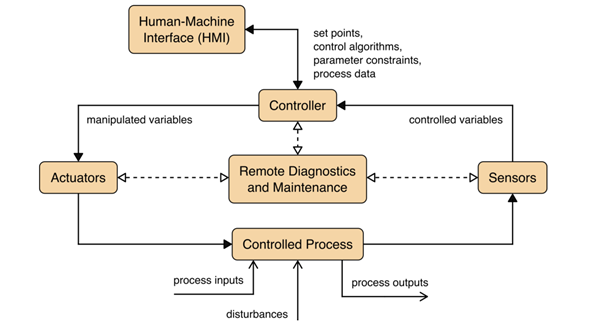

# Defining the Domain: CPS, OT, and ICS

When we talk about securing industrial environments, it is important to recognize that not all digital systems are created with the same goals in mind. Traditional IT focuses on data - how it is stored, processed, moved, and protected. Operational environments revolve around the physical processes. To understand this landscape, it helps to imagine three layers, each nested within the other.

**Cyber-Physical Systems (CPS)** are integrated systems combining computation, networking, and physical processes. This category is expansive and includes everything from an autonomous vehicle navigating traffic to the interconnected sensors and controllers that regulate a smart city.

Within CPS lies **Operational Technology (OT)**, a more specialized domain focused specifically on industrial, utility, and critical infrastructure environments. OT encompasses the machines, control software, and communication networks. These systems are built to keep essential processes running safely, reliably, and often continuously.

Within the OT domain, **Industrial Control Systems (ICS)** represent a major subset comprising technologies. ICS refers to the specific components that carry out control functions on the shop floor or within an industrial process. This includes Programmable Logic Controllers (PLCs) that open and close valves, Supervisory Control and Data Acquisition (SCADA) systems that supervise entire facilities, and Human–Machine Interfaces (HMIs) that operators use to monitor temperatures, pressures, and production flows.

ICS architectures form the backbone of industrial operations and are often used interchangeably with the term OT in cybersecurity contexts.

  

Overall, OT systems are essential for the operation of many industries, and they far outnumber Information Technology (IT) systems in use. OT security problems in these industries can have major impacts on the society and surrounding environment. 

## The Purdue Model: Organizing Systems by Function

The Purdue Reference Model provides a functional hierarchy commonly used to describe and segment OT environments. It separates systems based on their operational role and their proximity to the physical process, enabling clearer security boundaries and communication paths. While initially deployed in the 1990s, the Purdue Model today exists in many slightly modified versions, but in general there are 6 separate levels and additional DMZs between them. The image below shows these levels starting with Level 0 (the actual physical field devices) up to Level 5, where the enterprise IT resides.

 
*Source: Limes Security*

**Levels 0–1: Direct Interaction with the Physical Process**

Levels 0 and 1 include systems that interface directly with physical equipment. Interruptions or compromise at this layer have immediate, real-time operational impact.

- **Level 0 – Field Devices.** This level consists of sensors, actuators, valves, motors, and other field devices that monitor or affect physical parameters such as temperature, pressure, flow, or position.
- **Level 1 – Process Control.** This level contains devices that read data from Level 0 and issue control commands. Common technologies include:
  - **Programmable Logic Controllers (PLCs):** Small computers that execute the logic to run a machine.
  - **Remote Terminal Units (RTUs):** Similar to PLCs but typically deployed across long distances or remote infrastructure (e.g., pipelines).
  - **Intelligent Electronic Devices (IEDs):** Specialized control and protection equipment, used primarily in electric power systems.

**Levels 2–3: Indirect Interaction and Operational Management**

Levels 2 and 3 provide supervisory and operational functions. These systems do not control hardware directly but communicate with Level 1 devices to monitor or adjust the process.
- **Level 2 – Supervisory Control.** Systems at this level provide the interface for humans to interact with the machines.
  - **Human–Machine Interfaces (HMIs):** Localized operator screens for viewing process states and issuing manual commands to specific machines.
  - **Supervisory Control and Data Acquisition (SCADA) Systems:** Aggregated supervisory platforms that collect data from multiple controllers (PLCs/RTUs) to provide centralized visibility across an entire facility or distributed environment.
- **Level 3 – Operations Management.** Systems in this layer manage production workflows and facility operations across the site. Typical examples include:
  - **Manufacturing Execution Systems (MES):** Coordinate production processes, material flows, and operational tracking.
  - **Building Automation Systems (BAS):** Support infrastructure such as Heating, Ventilation, and Air Conditioning (HVAC), lighting, and environmental controls within industrial sites.

While the core of OT sits at **Levels 0–3**, the Purdue Model extends into the corporate world. It is important to note that this is not a strict, universal blueprint, but a reference model to help define trust boundaries.
- **Level 3.5 – IT/OT DMZ (Demilitarized Zone).** This is the most critical security boundary. It acts as a "buffer" between IT and OT. Since most security incidents originate in the IT environment (e.g., phishing), this layer prevents an infection from spreading directly to the controllers at Level 1.
- **Level 4 – Local Business Network.** The local office network at the plant site (e.g., local engineering workstations or site-specific ERP).
- **Level 5 – Enterprise.** The corporate headquarters network, where centralized services like email and global HR systems reside.
- **Level 5+ – Internet & Internet DMZ.** External connections, cloud-based analytics, and remote vendor access.

## The IT/OT Convergence: Defining Functional Context

In modern industrial settings, the distinction between IT and OT is not defined by the hardware itself, but by the _function_ the device performs and the _context_ in which it operates. This is known as IT/OT convergence - where traditional IT components are used to manage physical processes.

To determine if a system belongs in the OT domain, consider the following "litmus test" questions:
1. **Physical Impact:** If the device fails or is compromised, does it directly affect a physical process or life safety?
2. **Environment:** Is the device located on the factory floor or within a secured industrial network (Levels 0–3)?
3. **Primary Goal:** Is the system’s most critical requirement Availability (keeping the process running) rather than Confidentiality (protecting data)?

**Example: The Video Camera**

Consider a standard IP video camera. If that camera is installed in a corporate lobby to monitor for unauthorized visitors, it is a traditional **IT asset**. Failure results in a loss of records but no impact on business operations. However, if that same model of camera is placed on a factory floor to allow an operator to monitor a high-pressure furnace or a robotic assembly cell, it becomes a critical **OT asset**.

## Example OT Architectures

A typical OT system consists of control loops, human-machine interfaces (HMI)
and remote diagnostics and maintenance tools like depicted in the image below.

 
*Source: NIST SP 800-82r3, p. 11*

A control loop is meant – as the name suggests – to control some kind of
process. To do so, the loop employs a combination of sensors, actuators and
controllers. Sensors measure certain physical properties like temperature or
pressure and send these *controlled variables* to the controller. This component
acts as the brain of the loop. By interpreting the sent information based on a
control algorithm and target set points, so-called *manipulated variables* are
created. These are sent to the actuators, which are the components that directly
manipulate the controlled process according to the commands of the controller.

For example, a sensor that measures the temperature of a boiler sends the
controlled variable *temperature* to the controller. If the controller
determines that the measured temperature is below the set target, he instructs
an actuator to activate the heater rod of the boiler until the temperature
matches the set target temperature again.

This process can mostly be monitored and manipulated by human operators via the
so-called HMI. In our example the HMI maybe allows the operators to change the
target temperature and to observe the current state of the boiler. Finally,
remote diagnostics and maintenance tools can be used in case of abnormal
operation of the system or solution.

## Stakeholders

Achieving robust security in OT environments requires close collaboration between several key parties. The international standard for OT security, **IEC 62443**, identifies four primary roles, each with distinct responsibilities and security challenges:

- **Asset Owner:** The entity that operates the industrial facility (e.g., a power plant or factory). They are responsible for the overall security of the environment and are usually the ones who implement high-level defenses like network segmentation.
- **Product Supplier:** The company that develops and manufactures the components, such as PLCs, HMIs, or networking hardware. They are responsible for "security-by-design," ensuring the hardware and software are resilient before they reach the customer.
- **Integration Service Provider (Integrator):** The party that assembles individual components into a complete automation solution tailored for a specific site. They ensure that the different parts work together securely within the owner's infrastructure.
- **Maintenance Service Provider:** The entity (often an external vendor) responsible for the ongoing upkeep of the systems. They are a critical security link because they frequently require remote or physical access to the "heart" of the control system.

OT security challenges are different for these stakeholders, which is also
reflected in the different standards of the IEC 62443 series. For example, an
operator does not have access to the development process of the specific
component and thus cannot implement security measures at the source code level.

On the other hand, the operator more or less can shape the intended environment
where the solution is employed and therefor is capable of introducing mitigating
measures like strong network segmentation.

As the impact of security failures in OT can be tremendous, there is an
[increasing number of laws and regulations](./related-standards.md) governing the development and
operation of OT systems and devices. Examples are the European NIS2 and the
Cyber Resilience Act (CRA), the US EO14028 or the China Cybersecurity Law.
